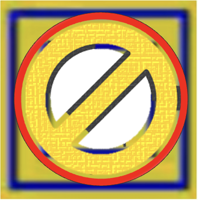
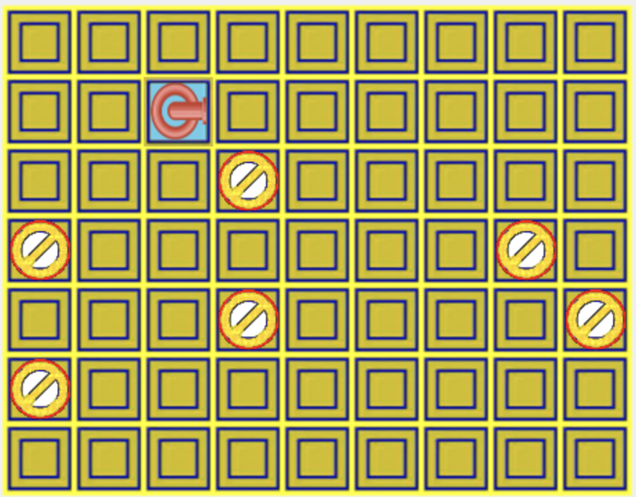

# Pipe Mania Game

## Description

Pipe Mania is a one-player puzzle game built with JavaScript and Canvas. The goal is to use pipe sections to connect a water source to its destination before time runs out and waters starts flowing.

## How to Play

1. **Objective**: Connect the pipes to form a continuous path.

## Features
- Colorful and engaging graphics.

## Installation
To play, clone the repository and run the following commands:

npm run build
npm run dev

# Pipes

Pipe sections are a key feature of this game. In this Pipe Mania, there are 7 possible types of pipe sections that can appear. These sections all have different orientations but share the same behavior on the board. In order implement more modular code, I created a Pipe class that randomly generates the different sections.

# Grid

The Grid class in Pipe Mania handles the logic for tracking flow through Pipes, displaying the board, and determining completion of the round. Starting at the source, Board finds the next position on the grid that the current Pipe leads to. It then evaluates if the pipe at the next position forms a valid connection with the current Pipe. If it does, Board repeats the evaluation for each subsequent Pipe until it reaches the destination or is unable to form a valid connection.

# Game

Game

The Game class joins together Pipes and Grid to create Pipe Mania. Game keeps an array of the next three Pipe sections to be put on the Board. Using keyboard event listeners. Game also controls the timer to countdown time until water begins flowing and calls Board to evaulate the result of the round once this time runs out. Based on the result from Board, Game allows players to continue on the to next level, retry a level, or play again starting from the first level.

## Célula Bloqueada

## Célula Inicial

## Tabuleiro

## Future Improvments 

