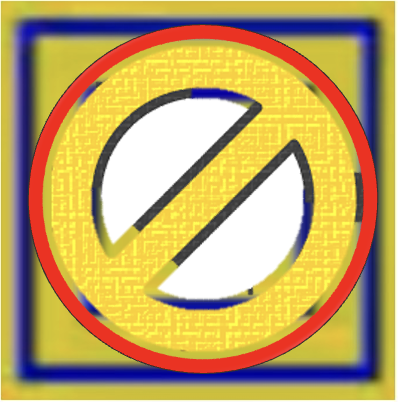
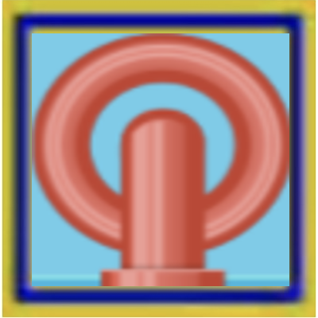
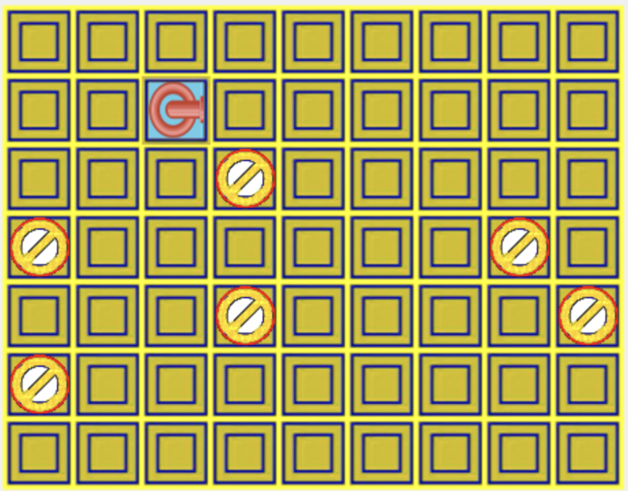

# Pipe Game - Documentation

## Setup
To play, clone the repository and run the following commands:

- npm run build
- npm run dev

## Overview

The **Pipe Game** is a puzzle game where the player needs to connect pipes to allow the flow of water from an initial position to the goal. The game consists of a **grid** where pipes can be placed, and a **pipe queue** that the player can use to place pipes on the grid.

The game starts with a **countdown timer** that counts down from 20 seconds. When the countdown reaches zero, the water flow begins. The player must place the pipes correctly to allow the water to flow along the correct path to the goal. The goal is to reach a score of **100 points** to win.

## Main Features

### 1. **Grid**
   - The grid consists of cells where pipes can be placed.
   - Each cell can either be occupied by a pipe or remain empty.
   - Blocked cells cannot be filled with pipes.

### 2. **Pipe Queue**
   - A queue of pipes is provided to the player, where pipes are removed from the front of the queue (FIFO).
   - The player can select pipes from the queue and place them on the grid.
   - The pipe queue is updated as pipes are used (new pipes are generated and added to the back of the queue).

### 3. **Countdown and Water Flow**
   - The game begins with a 20-second countdown.
   - When the countdown reaches 0, the water flow begins.
   - The player must use the pipes to create a path for the water.
   - When the water passes through a cell with a pipe, the player earns points.

### 4. **Score and Victory**
   - The player earns points by allowing the water to pass through valid pipes.
   - The goal is to accumulate **100 points** to win the game.
   - The game ends when the player can no longer place pipes correctly, and the "Game Over" screen is displayed.

### 5. **Game Over and Victory Screens**
   - When the player loses (fails to create a valid path for the water), the "Game Over" screen is shown.
   - When the player wins (reaches 100 points), the "Victory" screen is shown.

### 6. **Restarting the Game**
   - After either a victory or a loss, the game can be restarted by clicking the screen.
   - The game's state (score, time, grid, and pipe queue) is reset.

### Main Classes:

1. **Game**:
   - Controls the main game logic (starting the game, running the game loop, restarting, etc.).
   - Manages the user interface, such as the countdown, score, and canvas interactions.

2. **Grid**:
   - Represents the grid where pipes are placed.
   - Allows manipulation of the grid cells, including placing pipes and checking if the water path is valid.

3. **PipeQueue**:
   - Manages the queue of pipes available to the player.
   - Allows adding new pipes to the queue and removing the first pipe.

4. **Pipe**:
   - Represents a basic pipe that can be rotated or placed on the grid to form the water path.

5. **WaterPipe** (optional):
   - A special type of pipe that allows the water to pass through it. This can be used to represent specific types of pipes in the game.

## Future Improvements

### 1. **Modularization**
   - Break down the code into smaller, more reusable modules to improve maintainability and readability.
   - Separate concerns such as pipe logic, grid management, UI updates, and game state into different modules or services.

### 2. **Improve Pipe Flow (Cross Pipes)**
   - Enhance the logic for pipe connections, especially for complex pipe types like cross pipes (pipes that allow water to flow in multiple directions).
   - Add better visual representation for cross-pipes and their interaction with other pipe types.

### 3. **Block Cells with Water**
   - Implement functionality where certain cells become "blocked" once water has flowed through them.
   - These cells would no longer be available for placing pipes and could prevent the player from modifying parts of the grid once the water flow reaches them.

### 4. **Add Unit Tests**
   - Write unit tests to ensure the game’s core functionality is working as expected. This includes tests for the grid, pipe queue, pipe placement, and game logic.
   - Implement test coverage for edge cases, like trying to place a pipe in a blocked cell or attempting to complete the water path under challenging conditions.

### 5. **Apply Design Patterns**

   - **Singleton Pattern**: Ensure that certain game objects, like the `Game` instance or `PipeQueue`, follow the Singleton pattern so that only one instance of them exists throughout the game.
   - **Factory Pattern**: Use the Factory pattern for creating different types of pipes, especially if you plan to introduce more complex or special pipes in the future.
   - **Observer Pattern**: Implement the Observer pattern to handle the communication between the game state (such as the grid or pipe queue) and UI updates. For example, the grid could notify other parts of the game when a pipe is placed, water starts flowing, or the game is over.

### 6. **Responsiveness to Screen Size**
   - Make the game responsive to different screen sizes and device orientations. The grid, pipe queue, and HUD should adapt to ensure a good user experience on various devices (e.g., phones, tablets, desktops).
   - Implement dynamic resizing and scaling of the canvas, grid, and game elements to ensure everything is visible and playable on all screen sizes.

## Blocked cells

## Start Pipe

## Game Board

